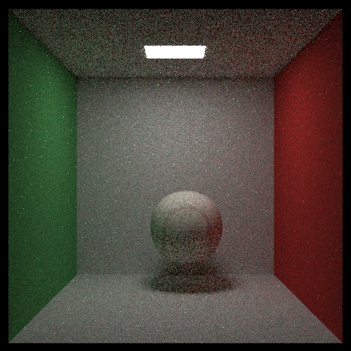
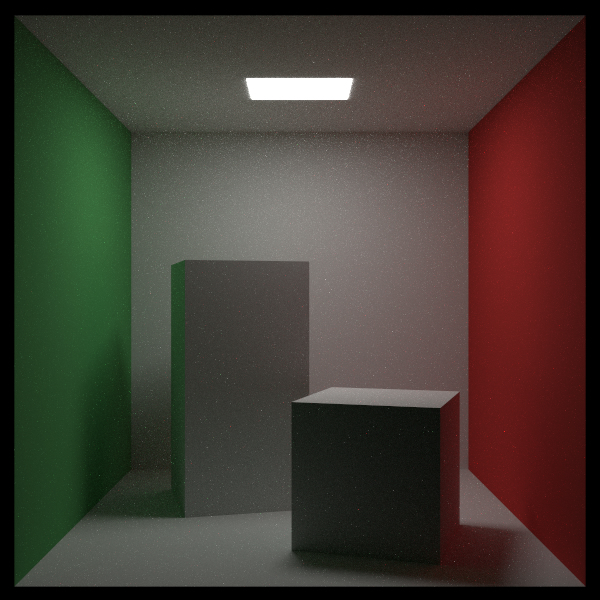
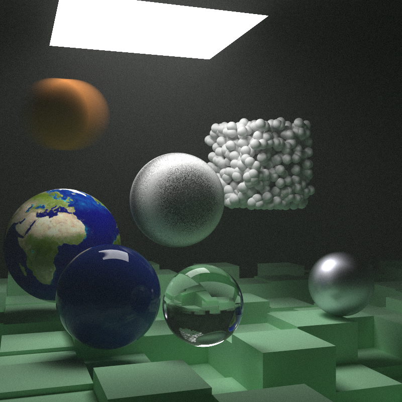
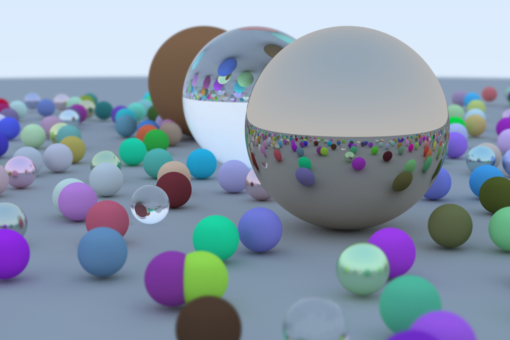

# RayTracing-referencebook

Outline:

- Reference Book:[《RayTracing In One Weekend》](https://raytracing.github.io/)

- Goal: accomplish with Rust 

Current Progress: 

bonus part:

- [x] track1: Reduce Contention
- [x] track2: Static Dispatch (增加泛型)
- [x] track4: PDF dispatch
- [x] track8: support for OBJ 

Reference Book:

- Book3 done

- Book2 done

- Book1 done

