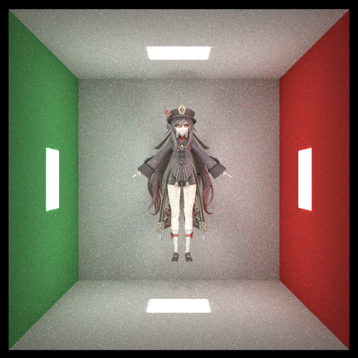
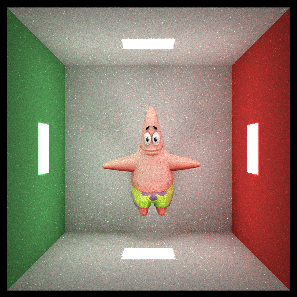
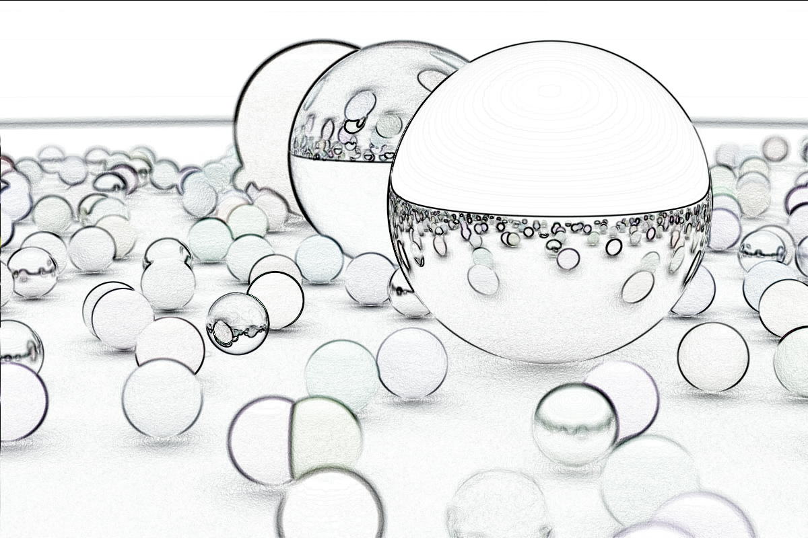

# RayTracing-referencebook

PPCA project by ACM Class2021

## Outline:

- Reference Book:[RayTracing In One Weekend](https://raytracing.github.io/)

- Goal: accomplish with Rust 

## Current Progress:

1. **bonus part**:
- [x] track 1: Reduce Contention

- [x] track 2: Static Dispatch (增加泛型)

- [x] track 3: Code Generation (add function-like macro)
  
    具体可以查看raytracer_codegen文件下的macro.md(学习笔记)

- [x] track 4: PDF dispatch

- [x] track 6: support PDF for Translate

- [x] track 7: Benchmark (可以做单条光线的, 也可以做多条光线为input)

- [x] track 8: support for OBJ 

- [ ] 《Unity Shader入门精要》学习ing...
  
  > 已完成: 
  > 
  > 1. 利用sobel算子实现图片的边缘检测 
  > 
  > 2. 法向贴图(凹凸贴图) [参考文章](https://docs.unity3d.com/cn/2021.1/Manual/StandardShaderMaterialParameterNormalMap.html)

- [x] 三本书已完成

### 贴图部分

---

- 在obj的三角形相对少的情况下, 可以通过增加环境亮光和**光源数量**来达到消除物体棱角的效果

- **一定一定一定**要把tobj里的single_index: true, 否则贴图的png/jpg不会和triangle匹配

- 每个triangle的$\vec{n}$ 有两种计算方法:
  
  1. 利用三个点来算叉积
  
  2. 利用tobj库处理好的normals, 将三个点的normal相加取平均
     
     后者虽然可能法向量不严格垂直于三角形平面, 但会令最后效果更加真实.

胡桃贴图

派大星

1. Reference Book Part:

学习重点: Monte Carlo Integration

$$
I = \int_a^b f(x) dx
$$

建立一个连续型随机变量$\chi$, 满足$\chi$在$[a,b]$比如均匀分布, 则其概率密度函数$p(x) = \frac 1{b-a}$

$$
\begin{aligned}
E(\chi) &= \int_a^b \frac{f(x)}{p(x)} p(x) dx\\
&=I
\end{aligned}
$$

同时我们随机采样$N$次, 则有$\overline{X}=\frac 1N \sum X_i$为$E(X)$的无偏估计.

在RT中, 要做的是:

$$
Color = \int A \cdot s(direction) \cdot color(direction)
$$

$s(direction)$: 为材质表面在$dir$方向的概率密度函数

$color(direction)$: 为该方向射来的光的RGB参数

- Book3 final scene

- Book2 final scene

- Book1 final scene

这里的random_scene() 出现了两个小球相交的情况

解决办法:

1. 多随机几次
2. 每次不断随机一个小球直至与前面的球不相交

实现边缘检测:
